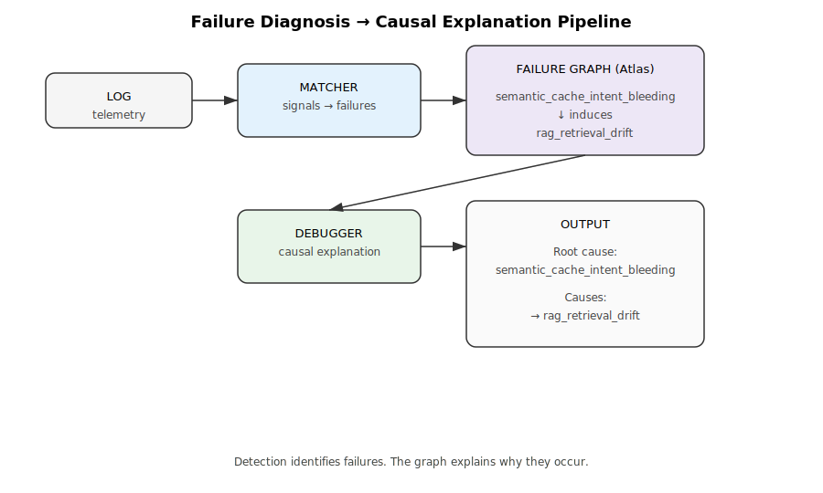

# agent-failure-debugger

agent-failure-debugger is a CLI tool that explains WHY failures happen.

It converts detection results into causal explanations.

---

## WHAT IT DOES

Input:
- matcher output (detected failures)
- failure graph (Atlas)

Output:
- root cause candidates
- causal relationships
- explanation

---

## WHY (core purpose)

This tool answers:

WHY did this failure happen  
and what caused it upstream?

---

## Pipeline



---

## Prerequisite: Matcher

This tool expects matcher output as input.

The matcher is responsible for:

log → signals → failure detection

This repository does not include the matcher implementation.

---

## Output Value

Transforms failure detection into causal understanding.

---

## Input Example

```json
[
  {
    "failure_id": "semantic_cache_intent_bleeding",
    "diagnosed": true,
    "confidence": 0.9
  },
  {
    "failure_id": "rag_retrieval_drift",
    "diagnosed": true,
    "confidence": 0.6
  }
]
````

---

## Output Example

```json
{
  "root_candidates": [
    "semantic_cache_intent_bleeding"
  ],
  "failures": [
    {
      "id": "semantic_cache_intent_bleeding",
      "confidence": 0.9
    },
    {
      "id": "rag_retrieval_drift",
      "confidence": 0.6,
      "caused_by": ["semantic_cache_intent_bleeding"]
    }
  ],
  "causal_links": [
    {
      "from": "semantic_cache_intent_bleeding",
      "to": "rag_retrieval_drift",
      "relation": "induces"
    }
  ],
  "explanation": "semantic_cache_intent_bleeding induces rag_retrieval_drift"
}
```

---

## Design

* no inference beyond graph
* graph is the source of truth
* matcher and debugger are separated

---

## Usage

```bash
python main.py input.json failure_graph.yaml
```

Defaults:

```
input.json
failure_graph.yaml
```

---

## Example

```
semantic_cache_intent_bleeding → rag_retrieval_drift
```

Output:

```
Root cause: semantic_cache_intent_bleeding  
Effect: rag_retrieval_drift
```

---

## Relationship to Atlas

This tool depends on:

* LLM Failure Atlas (graph structure)

It does not define failures itself.

---

## Relationship to PLD

Maps directly to PLD phases:

* Drift → initiating failure
* Propagation → downstream failures
* Outcome → system effect

---

## Summary

Detection tells you what failed.
Debugger tells you why it failed.

---
